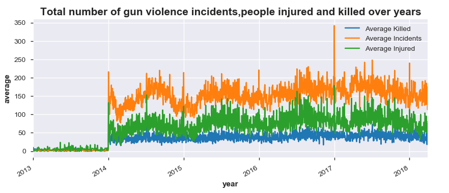
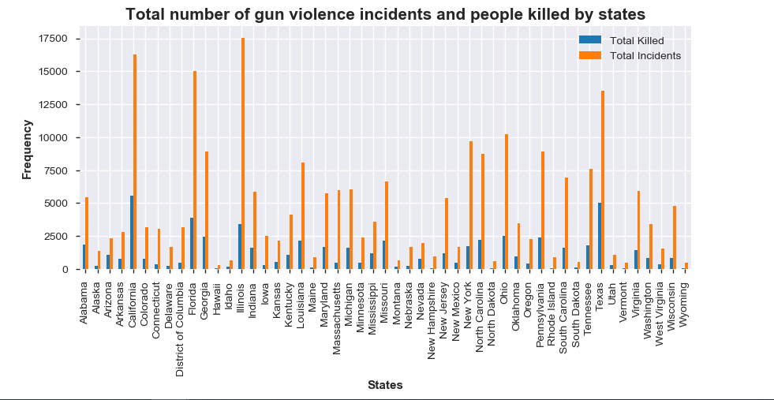
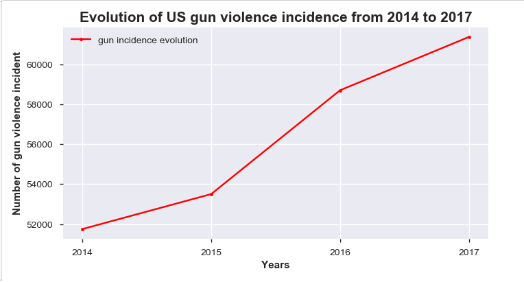
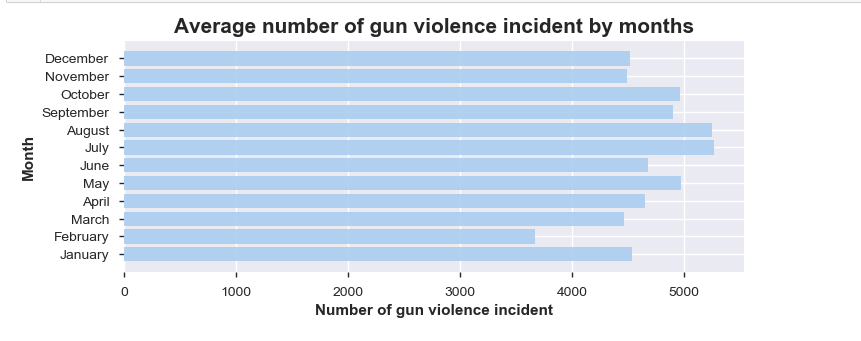

# US_gun_violence
Visualizing and analyzing data about US_Gun Violence from 2013 to 2019

## Table of contents
* [General info](#general-infos)
* [Screenshots](#screenshots)
* [Technologies](#technologies)
* [Findings](#findings)
* [Status](#status)
* [Contact](#contact)

## General info
This is an exploration data analysis on US Gun Violence data from 2013 to 2019, The aim of the project is to determine period and location where gun violence happens more in US.making while chosing college majors. Graphs are used to do exploratory analysis, the data has 239677 observations and 24 variables.

## Screenshots

## Technologies
Programming Language: Python
Packages:
pandas
numpy
pandas_profiling
matplotlib.pyplot 
seaborn as sns

## Findings
Evolution of US gun violence in time 
Period with high occurence of gun violence
Location with high occurence of gun violence 
People injured and killed during gun violence 

## Status
Project is completed

## Contact
Can contact me via my mail. [missewoudiane@gmail.com](missewoudiane@gmail.com) 
